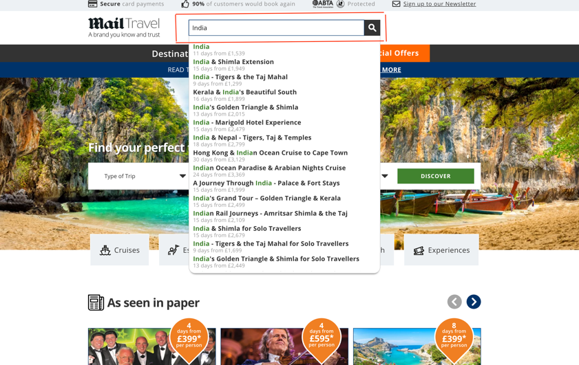
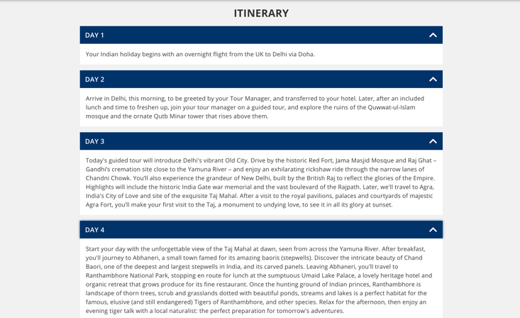
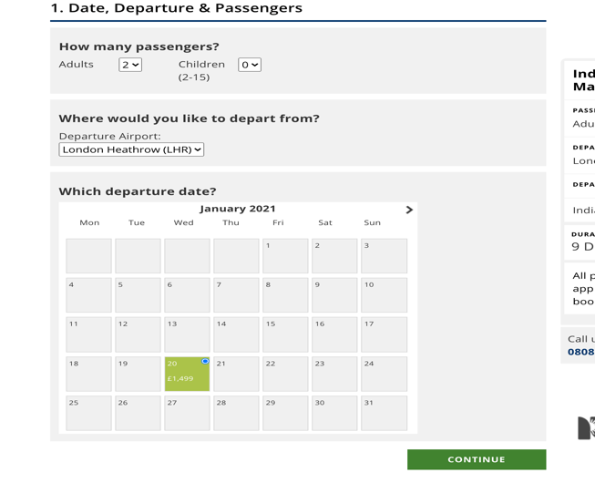
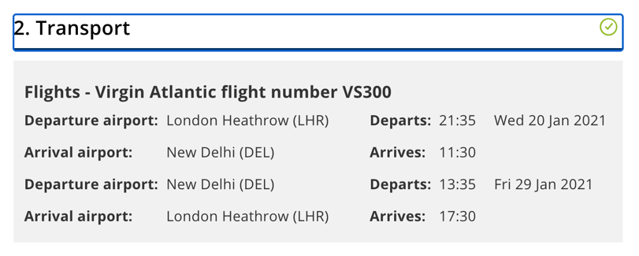
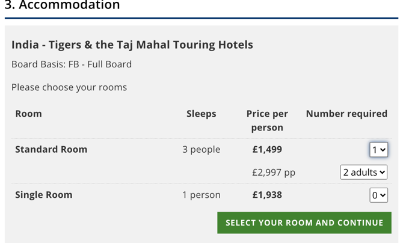
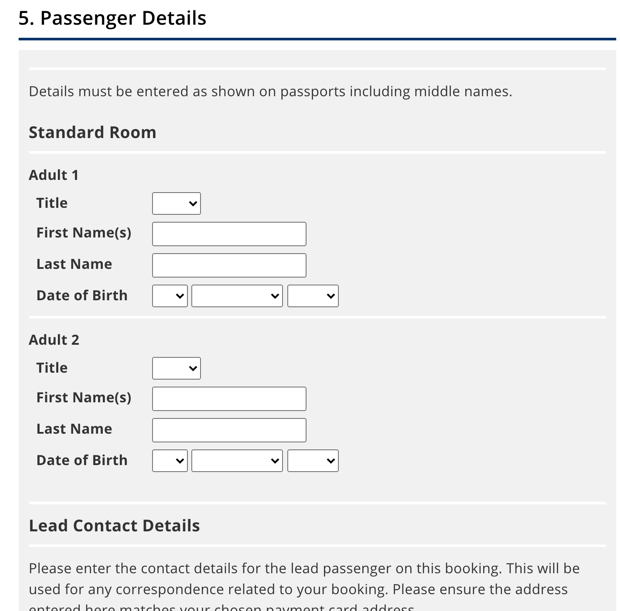

#Serenity Framework TravelProject
##Introduction

Name | XXXXXXXXXXXXX XXXXXXXXXXXXXXXXXXx
-----------------------|------------------------
Project Title | SDET Take Home Test
Build | Maven
Framework |Java Cucumber with Junit , Selenium Webdriver - Serenity Steps 

######Requirements
    • Perform automation UI testing for the following test cases using the following tools:

        • Java
        • Cucumber or Junit using Serenity Screenplay pattern
        • Selenium WebDriver
        • Maven
    Display the test results reports using Serenity.

    Note: Send us your source code, serenity reports html files in a zip file or upload to a GitHub repo and share the details.

    Url: https://www.mailtravel.co.uk/

        1. Go to Mailtravel.co.uk page, verify the title
        2. In the Search box, type the “India”


        3. Click “More Info” on the first result.


        4. Make sure it’s displaying days, price and telephone number in the div. 


        5. Click on “Itinerary”


        6. Make sure all the days in Itinerary are displaying some information.
              

        7. Click on “Book Online”


        8. Verify its selecting the first available date in calendar with default values

       
        9. Make sure that selected date is set as departure date and (departure date + 9) as the last date.


        10. In the “Accommodation” enter the below values.
            

        11. In the “Extras” select default value

        12. Fill out dummy information in the “Passenger Details” and make sure its proceeding to payment page.


        13. Also, in the main mailtravel.co.uk page, click on “Sign up to our Alerts”, fill out some dummy information and make sure you are getting the confirmation page.


###Installation guide: 
    This is a Maven project. 
    So it's assumed that the host running this code has Java and Maven installed and JAVA_HOME already set. 

    Here is the guide for maven installation just in case : https://maven.apache.org/install.html

###Dependencies
Project gets all dependencies from Maven repository. So no additional installation needed.

Below are the dependencies are being used for this project :

    * Junit,
    * Cucumber
    * Serenity
    * JavaFaker
    * Selenium Webdriver
  

###Build and run your project : 
This is a Maven project and tests are written in JUnit . so we use Maven command line commands to run the project from terminal as below to pick up JUnit tests and see the Serenity reports:
````
mvn verify
````
or 
````
mvn clean verify
````

A link will then be provided where you can find your Serenity report in the target folder.
###Framework 
Framework is built with Cucumber BDD in combination with Serenity but can be expanded to integrate more advanced Serenity report features.  It is created using  basic Page Object Model design pattern with Serentity Steps but it can be improved if needed.
